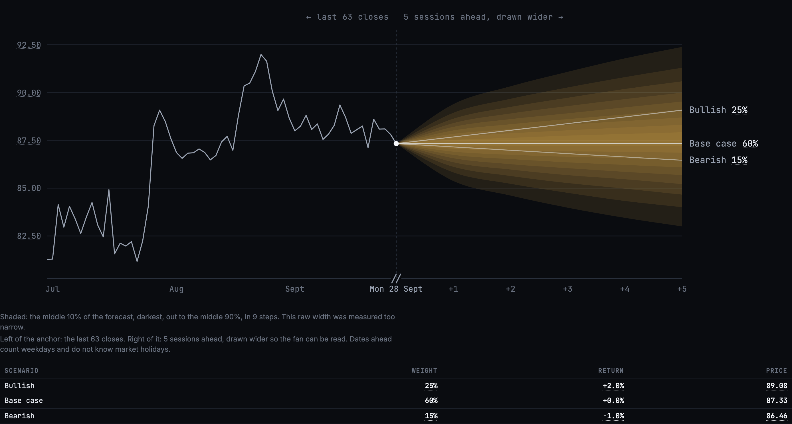
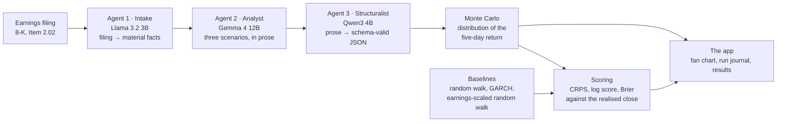

# M.A.P. — Market's Agentic Projections

M.A.P. runs three open-weight models on a local machine to read a company's earnings filing and forecast its share price five trading days ahead, as a probability distribution rather than a single number. The forecasts are the demo and the evaluation is the point: each one was scored against what the price actually did and against three baselines, and the tests that decide anything were written down before their results existed. The headline is negative: **it does not beat a plain random walk or GARCH on the companies it was developed on.**



*KO, five sessions out, replayed from a recorded run: the raw fan, which was measured too narrow, anchored on a price taken during the session rather than a close.*

**[→ Open the app](PLACEHOLDER_URL)** — the run journal and the scored results, every figure marked with where it came from. *A research and engineering exercise, not financial advice. Published for review; no licence is granted for reuse — see [Licence](#licence).*

---

## How it works



Each agent is a contract rather than a model, so swapping the model behind one is a config edit. The third is deliberately small: with JSON-schema constrained decoding the sampler makes invalid tokens unreachable, so model size is not what makes its output valid. Models load one at a time on a 16 GB Apple M1, and one analysis takes six to twelve minutes.

**All inference is local, and no data is sent to a third-party model provider.** This is *not* "100% offline": prices come from Yahoo Finance and filings from SEC EDGAR, and those parties see what is asked of them. The models already know how the histories of many well-known companies turned out, so the corpus is split into filings from after their training cutoff and from before it, and the difference between the two is measured (finding 2 below).

---

## How it compares

Each baseline forecasts the same five-day return as a distribution and is scored on the same outcomes. All three were committed on 2026-08-15, before anything was scored, and last changed on 2026-08-30, before the first result on 2026-09-02. The figures below are M.A.P. against the baseline on 175 clean-band development items in 18 date clusters, with 95% cluster-robust intervals; lower scores are better, so a positive difference means M.A.P. is worse.

| Baseline | What it assumes | CRPS | Log score |
|---|---|---|---|
| **Random walk** | No drift, and the stock's volatility is what its own history says. | M.A.P. **worse by 5.4%** [+0.00071, +0.00278]; excludes zero | **worse by 12.9%** [+0.080, +0.364]; excludes zero |
| **GARCH(1,1)** | No drift, but volatility clusters: recent turbulence predicts the next few days'. | indistinguishable [−0.00035, +0.00220] | **worse by 12.0%** [+0.063, +0.362]; excludes zero |
| **Earnings-scaled random walk** | A random walk whose volatility is widened for earnings windows, by a factor fitted on that company's own past earnings. | indistinguishable [−0.00222, +0.00111] | indistinguishable [−0.225, +0.207] |

"Indistinguishable" means the interval spans zero. It is not evidence of no difference.

These baselines are hard to beat because a drift estimated from a short history is mostly noise, so they set the expected move to zero and put all their effort into volatility, the one thing a short history does tell you.

---

## What it found

**It does not beat a plain random walk or GARCH on the companies it was developed on** (table above). It called direction right on 87 of 175 items (49.7%), no better than a coin, and its probability of an up move only ranges from 0.369 to 0.631, so it largely declines to have a view. Of the 709 filings in the corpus, 701 produced a forecast and 8 failed, each by an agent generating its whole token budget and emitting no answer. An ablation that removed the analyst ran, but only two of its four arms produced comparable numbers, so it has no primary result; what survives is descriptive ([Phase 5](docs/results.md#phase-5--the-ablation-and-what-remains-designed)).

Four more things were measured. Intervals below are the recorded ones; the bootstrap has since pinned the order it sorts tied days in, and under that order one verdict changes (the development half of finding 4) while every other interval moves by at most 0.006 ([both orders](docs/results.md#which-order-an-interval-was-computed-in)).

**1. The stated uncertainty was too narrow, and a correction fixed that on unseen data after failing its own development test.** The calibration ratio was 0.733 [0.637, 0.801], where 1.0 is calibrated. A shift-and-widen correction fitted on the 175 development items **missed its pre-registered success condition**, and that condition had named a threshold without naming its estimator, so which reading was right was never written down. Nothing said whether a failed condition still spends the holdout, so it was **spent anyway: a decision Kamil made having seen the failure, recorded in git note record 12**. On the 173 holdout items the correction changed log score by −0.288 [−0.453, −0.111] and CRPS by −0.0009 [−0.0018, −0.0001], both better and both excluding zero. **That is better calibration, not better forecasting.** How the corrected forecast compares with the baselines on the holdout, pre-registered as S5, **survives only as one sentence**: it beats the earnings-scaled random walk on CRPS and still loses to GARCH and the random walk on both rules. No figure or interval for it exists in any artifact, so that is what the sentence claims and it cannot be checked ([Findings #57](notebook/Findings%20&%20Incidents.md)). [Phase 3 and the holdout in full](docs/results.md#phase-3--the-correction-and-the-one-shot-test).

**2. No measurable training-cutoff leakage.** Filings from before the models' cutoff would score better if the models remembered rather than forecast. They do not: the difference is −0.00169 [−0.0093, +0.0060] in mean CRPS. This design could have detected gross memorisation and could not have detected a subtle familiarity effect of a few percent. [Leakage in full](docs/results.md#phase-2--the-measurement).

**3. The tails are heavier than a normal distribution allows, and that replication was only partial.** On the second band the counts replicated, with 8 outcomes past three standard deviations against 0.48 expected. But the pre-registered test also required the tail ratio's interval to exclude 1.0, and it reached down to 0.9945, short by 0.0055. The Student-t successor it would have triggered was not adopted, and the comparison with the baselines' tails is quoted from the record and cannot be re-derived from the export. [Tails in full](docs/results.md#registered-replications).

**4. Volatility compression replicated on a second band.** M.A.P. states too narrow a range of volatilities across companies: on the second band the corrected slope of its volatility on the baselines' is 0.409 against the random walk and 0.327 against GARCH (1.0 would be right), and on the largest 6% of moves its volatility is about half the baseline's. The development half cannot carry the claim by itself, because its widest interval's upper bound against the random walk sits on 1.0 and falls on either side of it depending on how tied days are ordered. [Compression in full](docs/results.md#registered-replications).

Everything cut from this page is in [docs/results.md](docs/results.md#detail-the-readme-leaves-out), not deleted.

---

## Why you can trust it

- **The corpus was frozen first, with two stated limits.** 709 filings from 120 companies were committed before any forecast on them was made (`dfd2fa5`, 2026-08-14, *"FREEZE THE CORPUS"*), but not before all inference, since the pipeline was exercised on sample documents from 2026-08-11. Membership was amended once, the same day, from 727 to 709 forecasts, by the pre-registered replacement rule.
- **22 pre-registrations are stored as git notes**, each written before the result it constrains. GitHub does not show notes and `git clone` does not fetch them, and the ordering is evidence rather than proof, since dates in a repository are writable.
- **The holdout was spent once**, and the tool refuses a second spend before computing anything. Its per-item scores were printed once and never persisted, so they cannot be recovered.
- **Every number on screen carries its provenance** (measured, derived or quoted), and an unmarked number fails a test.
- **The Findings log** ([notebook/Findings & Incidents.md](notebook/Findings%20&%20Incidents.md)) records the incidents and mistakes, including ones that changed a result.
- **The history was cleaned once**, on 2026-09-30, to remove personal details. Every commit has a new ID, the records still cite the old ones, and [docs/commit-map.tsv](docs/commit-map.tsv) pairs them.

[How the record was kept, in full](docs/results.md#how-the-record-was-kept).

---

## Live analysis

`uv run map serve` adds the one thing that is not a read of the record: every company that files earnings has a page, and Analyse there fetches its latest earnings 8-K, runs the three agents, and draws the forecast from the latest settled close. It only runs on a machine with the models on it; the published site is static files, says so, and shows one recorded run instead. **The rule: a live run is always labelled as outside the record and never counted in it, and its fan is drawn raw and marked uncalibrated unless it meets all three conditions the correction was tested on (five sessions, anchored within one trading day of a filing, a company the corpus filters accept).** [Live analysis in full](docs/results.md#live-analysis-in-full).

---

## Verify it yourself

```bash
git fetch origin 'refs/notes/*:refs/notes/*'
git log --format='%h %ad %s' --date=iso refs/notes/commits   # 22 appends, in order, each timestamped
git notes show 171a4d6                                        # the records themselves

uv sync --extra dev
uv run pytest                     # 100% coverage; no inference server, no network
uv run lint-imports               # the architecture contracts
node --test ui/tests/*.test.mjs   # the front end; no build step
```

`%ad` is the author date, which is deliberate: a rebase moved some commit dates. On a fresh clone most front-end tests skip, with the reason, because a clone cannot regenerate the export: `var/` holds the ledger, runs and scores and none of it is committed. `uv run map export --allow-partial` builds what a clone can, the frozen corpus and five named absences. [More](docs/results.md#reading-the-pre-registrations-and-why-the-dates-can-be-trusted).

---

## Documentation

| | |
|---|---|
| [docs/results.md](docs/results.md) | What was measured, in full, with the intervals and the samples |
| [docs/methodology.md](docs/methodology.md) | Corpus construction, scoring rules, baselines |
| [docs/honest-claims.md](docs/honest-claims.md) | What is overstated about projects like this, and the accurate version |
| [docs/setup.md](docs/setup.md) | Requirements, install, model names per backend |
| [docs/cli.md](docs/cli.md) | `map run`, `map prices`, `map runs`, `map export` |
| [docs/export-contract.md](docs/export-contract.md) | Every file the app reads, field by field |
| [docs/publishing.md](docs/publishing.md) | Building a copy to host, and what is third-party |
| [decisions/](decisions/) | Every non-obvious choice and the alternatives rejected |
| [notebook/](notebook/) | Findings & incidents, the development timeline, current state, the design record |
| [CLAUDE.md](CLAUDE.md) | The working agreement this was built under |

---

## Licence

Copyright © 2026 Kamil Shirinov. All rights reserved.

**Published for review. No licence is granted for reuse, redistribution or derivative
work.** You are welcome to read the code, run the tests and check the claims.

The export served by the app contains data obtained from third parties — SEC EDGAR filings
metadata and Yahoo Finance closes. Those remain subject to their own terms; see
[docs/publishing.md](docs/publishing.md).
